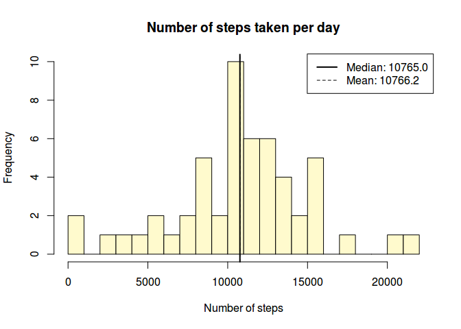
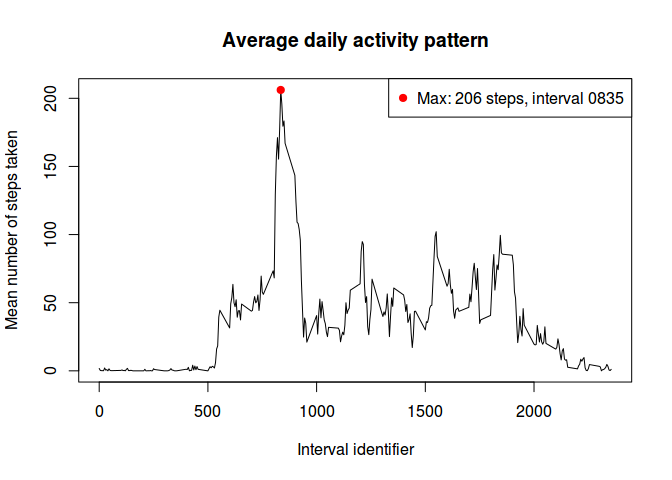
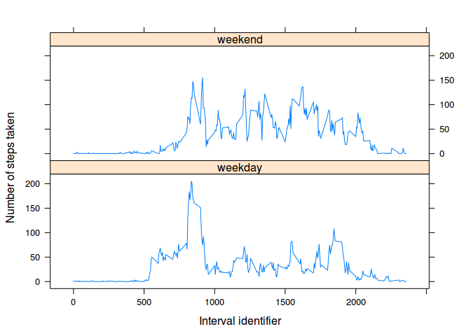

# Reproducible Research: Peer Assessment 1


## Loading and preprocessing the data

First of all, we must make sure the data file exists and then load it:

```r
if (!file.exists('activity.csv')) {
  # Assume 'activity.zip' exists (it is included in the git repo)
  unzip('activity.zip')
}

# We use "na.strings = 'NA'" to correctly identify missing values
dataset <- read.csv('activity.csv', header = T, na.strings = 'NA')
dataset <- transform(dataset, date = as.Date(date, '%Y-%m-%d'))
```


## What is mean total number of steps taken per day?


```r
# STEP 0. Consider only rows without missing values
ds.complete <- dataset[complete.cases(dataset),]

# STEP 1. Sum the number of steps taken each day
ds.comp.date <- aggregate(steps ~ date, FUN = sum, data = ds.complete)

# STEP 2. Plot the histogram
# I'm using the 'with()' function to avoid cluttering the code with
# 'ds.comp.date$' everywhere -- improves legibility.
with(ds.comp.date, {
  hist(steps, col = 'lemonchiffon', br = 20,
       xlab = 'Number of steps', ylab = 'Frequency',
       main = 'Number of steps taken per day')
  
  # Draw a thick line for the median and a thin dashed one for the mean
  abline(v = median(steps), lwd = 2)
  abline(v = mean(steps), lty = 2)
  
  # Report both median and mean on the legend
  legend('topright', lty = c(1, 2), lwd = c(2, 1),
         legend = c(sprintf("Median: %.1f", median(steps)),
                    sprintf("Mean: %.1f", mean(steps))))
})
```

 


```r
# STEP 3. Calculate and report the median and mean steps taken per day
# (I have also reported these values in the histogram's legend)
mean(ds.comp.date$steps)
```

```
## [1] 10766.19
```

```r
median(ds.comp.date$steps)
```

```
## [1] 10765
```


## What is the average daily activity pattern?


```r
ds.comp.int <- aggregate(steps ~ interval, data = ds.complete, FUN = mean)

with(ds.comp.int, {
  plot(steps ~ interval, type = 'l',
       xlab = 'Interval identifier',
       ylab = 'Mean number of steps taken',
       main = 'Average daily activity pattern')

  # Calculate coordinates for the peak number of steps
  max.x <- interval[which.max(steps)]
  max.y <- max(steps)
  
  # Plot the point of maximum number of steps
  points(x = max.x, y = max.y, pch = 19, col = 'darkred')
  
  legend('topright', col = 'darkred', pch = 19,
         legend = sprintf('Max: %.0f steps, interval %04.0f', max.y, max.x))
})
```

 


```r
# Report the interval with the maximum number of steps (already shown in
# the plot above, in the legend).
with(ds.comp.int, interval[which.max(steps)])
```

```
## [1] 835
```

## Imputing missing values

It is now time to deal with all those `NA` values we have been ignoring thus far.
I'll use the following strategy: for every `NA` in the original dataset, the new dataset will have the *median* value of steps for the corresponding `interval`. I have chosen the median and not the mean because it is much less affected by extreme values, giving us a more conservative guess of what the real value might be.


```r
# Calculate and report the number of missing values in the dataset
sum(is.na(dataset))
```

```
## [1] 2304
```

```r
# Calculate median value of steps for each interval
ds.comp.median <- aggregate(steps ~ interval, data = ds.complete, FUN = median)

# Merge the original dataset with the medians calculated
ds.full <- merge(dataset, ds.comp.median, by = 'interval',
                 suffixes = c('', '.median'))

# Replace `NA`s in the 'steps' variable with the corresponding value on the
# 'steps.median' column
missing <- is.na(ds.full$steps)
ds.full$steps[missing] <- ds.full$steps.median[missing]

# Delete the 'steps.median' column and reorder the dataset
ds.full <- subset(ds.full, select = -steps.median)
ds.full <- ds.full[order(ds.full$date, ds.full$interval),]

# Now re-aggregate the data by date
ds.full.int <- aggregate(steps ~ date, FUN = sum, data = ds.full)

# ...and replot the histogram
with(ds.full.int, {
  hist(steps, col = 'lemonchiffon', br = 20,
       xlab = 'Number of steps', ylab = 'Frequency',
       main = 'Number of steps taken per day')
  
  # Draw a thick line for the median and a thin dashed one for the mean
  abline(v = median(steps), lwd = 2)
  abline(v = mean(steps), lty = 2)
  
  # Report both median and mean on the legend
  legend('topright', lty = c(1, 2), lwd = c(2, 1),
         legend = c(sprintf("Median: %.1f", median(steps)),
                    sprintf("Mean: %.1f", mean(steps))))
})
```

 


## Are there differences in activity patterns between weekdays and weekends?


```r
# Create a new factor variable representing whether a given date corresponds to
# a 'weekday' or a 'weekend':
ds.full <- transform(ds.full,
                     wday = as.factor(ifelse(as.POSIXlt(date)$wday %in% 1:5,
                                             'weekday', 'weekend')))

# Re-aggregate data
ds.new <- aggregate(steps ~ interval + wday, data = ds.full, FUN = mean)

# And now with lattice:
library(lattice)
xyplot(steps ~ interval | wday, data = ds.new, type = 'l', layout = c(1,2))
```

 
