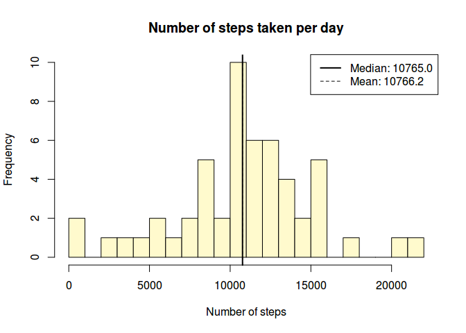
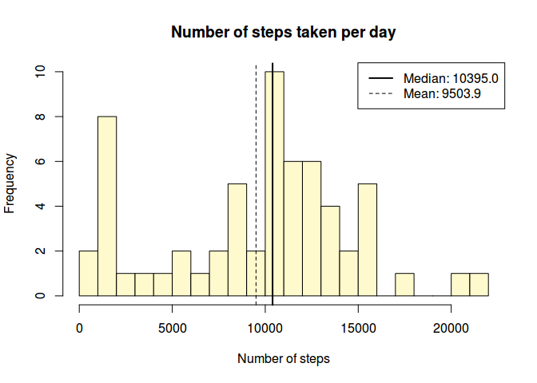

# Reproducible Research: Peer Assessment 1


## Loading and preprocessing the data

First of all, we must make sure the data file exists and then load it:


```r
if (!file.exists('activity.csv')) {
  # Assume 'activity.zip' exists (it is included in the git repo)
  unzip('activity.zip')
}

# We use "na.strings = 'NA'" to correctly identify missing values
dataset <- read.csv('activity.csv', header = T, na.strings = 'NA')
```

Then we must properly process the data. In our case, the `date` column should be of type `Date` and not simply a `factor` or `character`:


```r
# Convert the 'date' column to the appropriate data type
dataset <- transform(dataset, date = as.Date(date, '%Y-%m-%d'))
```

Now that the data is properly loaded and processed, this is what the dataset looks like:


```
## 'data.frame':	17568 obs. of  3 variables:
##  $ steps   : int  NA NA NA NA NA NA NA NA NA NA ...
##  $ date    : Date, format: "2012-10-01" "2012-10-01" ...
##  $ interval: int  0 5 10 15 20 25 30 35 40 45 ...
```

```
##      steps             date               interval     
##  Min.   :  0.00   Min.   :2012-10-01   Min.   :   0.0  
##  1st Qu.:  0.00   1st Qu.:2012-10-16   1st Qu.: 588.8  
##  Median :  0.00   Median :2012-10-31   Median :1177.5  
##  Mean   : 37.38   Mean   :2012-10-31   Mean   :1177.5  
##  3rd Qu.: 12.00   3rd Qu.:2012-11-15   3rd Qu.:1766.2  
##  Max.   :806.00   Max.   :2012-11-30   Max.   :2355.0  
##  NA's   :2304
```


## What is the mean total number of steps taken per day?

In order to calculate the mean total number of steps taken per day, we must summarize the data by `date`, applying the `mean` function to each group of `step`s.
Since we were told to ignore `NA` values in this part, we start by defining a new dataset (`ds.complete`) containing only the complete cases (rows without `NA`s), and work on that:


```r
ds.complete <- dataset[complete.cases(dataset),]
```

Then we summarize the data as described, yielding the following `data.frame`:


```r
ds.comp.date <- aggregate(steps ~ date, FUN = sum, data = ds.complete)
```

```
## 'data.frame':	53 obs. of  2 variables:
##  $ date : Date, format: "2012-10-02" "2012-10-03" ...
##  $ steps: int  126 11352 12116 13294 15420 11015 12811 9900 10304 17382 ...
```

Now we can plot the histogram with ease. I'm using the `with` command because it leads to much clearer code, since we can ommit the name of the `data.frame` we're dealing with:


```r
with(ds.comp.date, {
  hist(steps, col = 'lemonchiffon', br = 20,
       xlab = 'Number of steps', ylab = 'Frequency',
       main = 'Number of steps taken per day')
  
  # Draw a thick line for the median and a thin dashed one for the mean
  abline(v = median(steps), lwd = 2)
  abline(v = mean(steps), lty = 2)
  
  # Report both median and mean on the legend
  legend('topright', lty = c(1, 2), lwd = c(2, 1),
         legend = c(sprintf("Median: %.1f", median(steps)),
                    sprintf("Mean: %.1f", mean(steps))))
})
```

 

We were also asked to report both the median and the mean number of steps (which I have also included in the previous histogram):


```
## Median: 10765.0
## Mean: 10766.2
```


## What is the average daily activity pattern?

Next task is to give an idea of the pattern of average daily activity.
In other words, how does the average number of steps vary during the day?
We can answer this question by simply summarizing the data by `interval`s and then plotting the result as a time-series:


```r
# First we summarize data -- mean steps by interval
ds.comp.int <- aggregate(steps ~ interval, data = ds.complete, FUN = mean)

# And then we plot the time series:
with(ds.comp.int, {
  plot(steps ~ interval, type = 'l',
       xlab = 'Interval identifier',
       ylab = 'Mean number of steps taken',
       main = 'Average daily activity pattern')
  
  # I'm also going to add a point to indicate where the maximum number of steps
  # really occurs:
  
  # 1. Calculate coordinates for the peak number of steps
  max.x <- interval[which.max(steps)]
  max.y <- max(steps)
  
  # 2. Plot the point of maximum number of steps
  points(x = max.x, y = max.y, pch = 19, col = 'red')
  
  # Make a legend that also references the coordinates for the max point
  legend('topright', col = 'red', pch = 19,
         legend = sprintf('Max: %.0f steps, interval %04.0f', max.y, max.x))
})
```

 

We can easily discover which interval had the highest average number of steps (we calculated it as `max.x` in the previous plot):


```
## Interval with maximum average number of steps: 835
```


## Imputing missing values

Now we're going to deal with all the missing values we've been ignoring thus far.
Let's just get an idea of how many there are:

```r
sum(is.na(dataset))
```

```
## [1] 2304
```

That's a lot of `NA`s!
We have a few options to deal with them.
I chose to replace each `NA` value with the median number of steps for the corresponding interval -- I chose the median (instead of the mean) because it is much less influenced by extreme values, resulting in more conservative estimates of what the real values ought to be.

Let's see how this is done, then:


```r
# First, we calculate median value of steps for each interval
ds.comp.median <- aggregate(steps ~ interval, data = ds.complete, FUN = median)

# Merge the original dataset with the medians calculated
ds.full <- merge(dataset, ds.comp.median, by = 'interval',
                 suffixes = c('', '.median'))
```

Our `ds.full` dataset now looks like this (a few random lines from it):


```
##       interval steps       date steps.median
## 16072     2155     0 2012-11-18            0
## 16462     2225     0 2012-11-07            0
## 5027       650    29 2012-10-05            8
## 14587     1955     0 2012-11-27            0
## 11272     1520     0 2012-11-08            0
## 9117      1225    NA 2012-10-08            0
## 12936     1740    NA 2012-11-10           26
```

Now we only have to replace the `NA`s in the `steps` column with the corresponding value from the `steps.median` column. Afterwards we delete the `steps.median` column.


```r
# Replace `NA`s in the 'steps' variable with the corresponding value on the
# 'steps.median' column
missing <- is.na(ds.full$steps)
ds.full$steps[missing] <- ds.full$steps.median[missing]

# Delete the 'steps.median' column and reorder the dataset
ds.full <- subset(ds.full, select = -steps.median)
```

Notice how the `NA`s have disappeared and have been replaced by the median number of steps for the corresponding interval:


```
##       interval steps       date
## 16072     2155     0 2012-11-18
## 16462     2225     0 2012-11-07
## 5027       650    29 2012-10-05
## 14587     1955     0 2012-11-27
## 11272     1520     0 2012-11-08
## 9117      1225     0 2012-10-08
## 12936     1740    26 2012-11-10
```

To find out what happened to the overall distribution of the data after we corrected these `NA` issues, we can simply plot a new histogram and inspect the median and mean for the new data:


```r
# Now re-aggregate the data by date
ds.full.date <- aggregate(steps ~ date, FUN = sum, data = ds.full)

# ...and replot the histogram
with(ds.full.date, {
  hist(steps, col = 'lemonchiffon', br = 20,
       xlab = 'Number of steps', ylab = 'Frequency',
       main = 'Number of steps taken per day')
  
  # Draw a thick line for the median and a thin dashed one for the mean
  abline(v = median(steps), lwd = 2)
  abline(v = mean(steps), lty = 2)
  
  # Report both median and mean on the legend
  legend('topright', lty = c(1, 2), lwd = c(2, 1),
         legend = c(sprintf("Median: %.1f", median(steps)),
                    sprintf("Mean: %.1f", mean(steps))))
})
```

 

And now the median and mean values:


```
## Median: 10395.0
## Mean: 9503.9
```

As can easily be seen, the biggest difference is the left shift that occurred with the mean.
This was to be expected, since the mean itself is very sensitive to extreme values (high or low) and when we replaced the `NA`s, the new values introduced in the dataset were mostly low, skewing the data distribution a bit.
The median, however, remains close to its original position, due to its inherent resistance to extreme values (it is a better indicator of the data's real center).


## Are there differences in activity patterns between weekdays and weekends?

Are there any differences in activity between weekdays and weekends?
To answer this, we must first make sure we know the weekday for each date -- we'll create a new `wday` factor variable to represent that:


```r
is.wday <- as.POSIXlt(ds.full$date)$wday %in% 1:5
ds.full$wday <- as.factor(ifelse(is.wday, 'weekday', 'weekend'))
```

Here's how it looks like now:

```
##       interval steps       date    wday
## 16072     2155     0 2012-11-18 weekend
## 16462     2225     0 2012-11-07 weekday
## 5027       650    29 2012-10-05 weekday
## 14587     1955     0 2012-11-27 weekday
## 11272     1520     0 2012-11-08 weekday
## 9117      1225     0 2012-10-08 weekday
## 12936     1740    26 2012-11-10 weekend
```

Now we're ready to re-aggregate the data, but this time we'll keep the newly created `wday` column as well so we can later on plot the data separately for each level of this factor:


```r
ds.new <- aggregate(steps ~ interval + wday, data = ds.full, FUN = mean)
```

And now we plot the `steps` by `interval`, conditioned (separated by) the levels of the `wday` factor:


```r
library(lattice)
xyplot(steps ~ interval | wday, data = ds.new,
       type = 'l',      # time series
       layout = c(1,2), # 1 column, 2 rows
       xlab = 'Interval identifier',
       ylab = 'Number of steps taken')
```

 

The above plot clearly shows that during weekdays there is a period (from about 900 to 1800) during which the number of steps is significantly lower than the same period during weekends -- these discrepancies can be related to working hours (during weekdays), during which people walk considerably less, whereas during weekends they tend to go out and walk more during those same periods.
